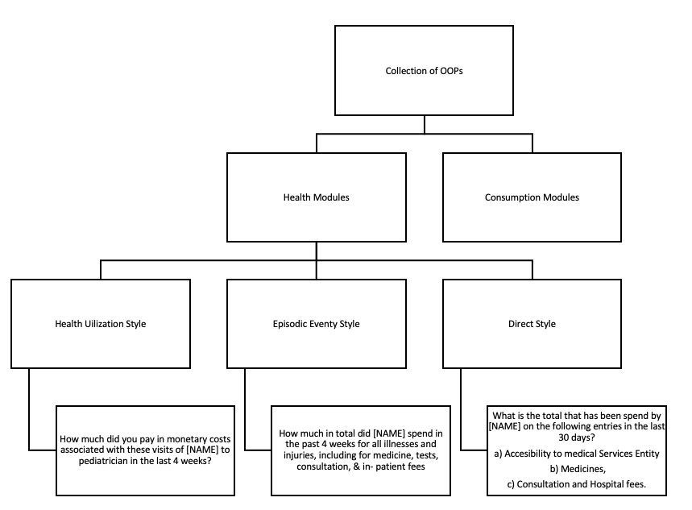

```{r setup, include=FALSE}
knitr::opts_chunk$set(echo = TRUE)
```

```{r load_data, include = FALSE}
library(tidyverse)
library(magrittr)
library(knitr)
library(kableExtra)
library(hexbin)
library(gridExtra)
library(bookdown)
library(sandwich)
library(lmtest) # for coeftest() 
library(sjPlot)
library(pscl)


library(cowplot)


rm(list=ls())

# Load data
df <- readRDS("LSMScompilation_tidy_outliers")
df_nontidy <- readRDS("LSMScompilation_nontidy_outliers")
tab_recall <- readRDS("LSMScompilation_recall_nitems")
tab_survey_names <- read.csv("~/Dropbox/LSMS_Compilation/Analysis/Tables_Figures/table1_survey_description.csv") %>% 
  arrange(survey)
hhinfo <- readRDS("LSMScompilation_hhinfo")
style_info <- read_csv("~/Dropbox/LSMS_Compilation/Analysis/Tables_Figures/table2_healthmodule_taxonomy.csv")

# Add hhinfo to DFs
df <- df %>% left_join(hhinfo, by="hhid_compilation")
df_nontidy <- df_nontidy %>% left_join(hhinfo, by="hhid_compilation")

# get list of surveys with both modules
surveys_bothmodules <- tab_recall %>% 
  select(survey) %>% 
  group_by(survey) %>% 
  mutate(count = n()) %>% 
  filter(count>1) %>% 
  select(survey) %>% 
  distinct()

```

# Search Strategy and Aggregation

The search started at the World Bank’s Microdata Library, where micro-surveys were collected from the Living Standards Measurement Surveys (LSMS) program. Data were retrieved from 80 surveys from the program which were publicly available. The surveys were filtered to only include The surveys were analyzed to include only those with two OOPs measurements—one in the consumption module, and once more in the health module. Out of the 80 initial surveys, only `r length(surveys_bothmodules$survey)` measured OOPs in both modules, which will be the sample that will be used in this work. The selected sample of surveys is exhibited in Table 1, along with information about the instruments used to capture OOPs in both modules.

The surveys went through a compilation process, where information on household's OOPs, hospitalizations, non-health consumption, and characteristics such as the household size, marital status and age of the householdhead, and rural or urban locations were collected. When available, we used aggregate consumption files provided by the surveys to estimate consumption measures. When no aggregate consumption file was available, consumption was computed by the benchmark methods detailed in Deaton and Zaidi (2002). When calculating consumption a broad definition was used, which includes food consumption, non-food consumption, imputed rent, and the cost of the use of consumer durables.

OOPs were calculated for each household on the health and consumption module. In the health module the OOPs were calculated as the sum of all health expenditures declared by each individual household member, and then adjusted to represent a 1-year recall period. The OOPs in the consumption module were calculated in similar fashion, by adding all health expenditures declared by the household in the module, and then adjusting them to a 1-year recall period. 

Despite a similar process to calculate OOPs in both modules, it is relevant to notice that each module captures OOPs in very different ways. The health module is not purposedly built to measure consumption, and OOPs are added as an extra, this results in three different styles in which OOPs can be captured in the health module (Exhibited in Figure 1). The first style is health care utilization, where each household member is asked whether or not they have used a specific health service in a determined amount of time. If they answer yes, a sequence of questions about the specific service ensues, including OOPs. On the other hand, if they answer no the sequence is skipped. The second style is episodic, where each household member is asked if they have suffered an illness or injury in the recent past. Similarly, if they answer yes a sequence of questions continues including OOPs. The third and least popular is the direct style, where each household member reports their expenses for a list of different health services and items. The direct style is not attached to the utilization of health services, or an episode of illness, every household member has to answer. The consumption module on the other hand is build to measure consumption, each household reports their expenses for a specified list of products, and services without a possibility of skipping questions.

A surprising part of the compilation process was working with the aggregate files of each survey, and notice that there is no common standard on how OOPs are reported. Aggregate files are created to calculate welfare and poverty rates, and there are opinions that as households recieve little utility from OOPs these should not be included into the total consumption used to calculate the poverty rate (CITE DEATON HERE). In practice, the exclusion or inclusion of OOPS into total consumption generates a confusing situation whereby some statistical agencies exclude OOPs altogether from total consumption, while others exclude only inpatient expenses. For example, the 2017 Ghana GLSS survey reports OOPs that do not include hospitalization expenses, but the total consumption estimate does include them. A previous version of the same survey in 2015, also did not include hospitalization expenses in the OOPs, but also excluded them from total consumption. Other issue presented itself in he "Malawi 2004 and 2010 surveys" (not included in our selected sample) which collected regular consumption modules without instruments for OOPs, but in the aggregate file OOPs collected from the health module were added into total consumption, therefore comparing estimates from two different modules.


```{r filter_surveys, include=FALSE}

# Keep only observations from selected surveys in df
df_bothm <- df %>% # df with surveys from both modules
  inner_join(surveys_bothmodules)

# keep only observations from selected surveys - nontidy
df_bothm_nontidy <- df_nontidy %>% 
  inner_join(surveys_bothmodules)

# What are the surveys without hhweights? -- both modules
surveys_nohhweight <- df_bothm_nontidy  %>% select(hhid_compilation, survey, hhweight) %>% 
  mutate(weight_missing = is.na(hhweight)) %>% 
  group_by(survey) %>% 
  summarise(per_missing = mean(weight_missing, na.rm = TRUE))

# What are the surveys without hhweights? -- all
surveys_nohhweight_all <- df_nontidy  %>% select(hhid_compilation, survey, hhweight) %>% 
  mutate(weight_missing = is.na(hhweight)) %>% 
  group_by(survey) %>% 
  summarise(per_missing = mean(weight_missing, na.rm = TRUE))

# Create DF with "fake" weights for surveys without them
df_bothm_nontidy_weightcorrected <- df_bothm_nontidy %>% 
  left_join(surveys_nohhweight) %>% 
  mutate(hhweight = ifelse(per_missing==1,1,hhweight)) %>%  # Give weight 1 to surveys withoyut hhweights 
  filter(Health>-1,Consumption>-1)  # take NAs out 

df_bothm_tidy_weightcorrected <- df_bothm %>% 
  left_join(surveys_nohhweight) %>% 
  mutate(hhweight = ifelse(per_missing==1,1,hhweight)) %>%  # Give weight 1 to surveys withoyut hhweights 
  filter(oops>-1)  # take NAs out 

```


```{r descriptive_table_healthmodule_only, echo=FALSE, warning=FALSE, message=FALSE}

# Tab2 - grab surveys and names, plus characteristics
tab2_descriptive <- tab_survey_names %>% select(survey, survey.name, LSMS) %>% 
  rename(`Survey Name` = survey.name,
         `LSMS Status` = LSMS) %>% 
  inner_join(tab_recall) %>%  # Get recall and nitems
  filter(module== "Health" ) %>% # for this part only use health module
  pivot_wider(names_from = module, values_from = c(recall,nitems)) %>% 
  group_by(survey) %>% 
  mutate(`Items Health Module` = first(nitems_Health),
            `Avg. Recall Health Module` = first(recall_Health)) %>% 
  select(survey, `Survey Name`, `LSMS Status`, `Items Health Module`, `Avg. Recall Health Module`) %>% 
  distinct()


# Add information about styles
long_descriptive2 <- style_info %>% 
  rename(survey = Survey) %>% 
  left_join(tab2_descriptive) %>% 
  mutate(Classification = case_when(Classification=='hosp' ~ 'utilization',
         Classification=='trad' ~ 'utilization',
         !Classification %in% c('hosp','trad') ~ Classification )) %>% 
  group_by(survey,Classification) %>% 
  mutate(n_style = n()) %>% 
  select(-Question,-question_number,-Classification2) %>% 
  distinct()
  #ungroup() %>% 
  #group_by(survey) %>% 
  #add_tally() %>% 
  #ungroup() %>% 
  #mutate( percent =  (n_style / n) *100  ) %>% 
  #select(survey,`Survey Name`,Classification,`Items Health Module`,`Avg. Recall Health Module`,percent) %>% 
  #distinct()


# Wide table
table_descriptive2_wide <- long_descriptive2 %>% 
  pivot_wider(names_from = Classification, values_from = n_style, names_prefix = "n_") %>% 
  mutate_at(c("n_episodic","n_direct","n_utilization"),funs(replace_na(.,0))) %>% 
  mutate_at(c("n_episodic","n_direct","n_utilization"),funs(round(.,1)))


# Almost ready include average OOPs
# Grab number of observations per survey and means
obs2 <- df_nontidy %>%
   left_join(surveys_nohhweight_all) %>% 
  mutate(hhweight = ifelse(per_missing==1,1,hhweight)) %>% # Give weight 1 to surveys withoyut hhweights
  select(hhid_compilation, Health, survey, nonhealth_consumption, hhweight,urban, hhsize,hhead_female,hhead_age,episodic_hosp) %>% 
  filter(Health>-1) %>%   # take NAs out 
  group_by(survey) %>% 
  summarise(Observations = n(),
            `Mean Non-Health Consumption` = round( weighted.mean(nonhealth_consumption,hhweight, na.rm = TRUE),1),
            `Mean OOPs Health Module` = round( weighted.mean(Health,hhweight, na.rm = TRUE),1),
            mean_urban = round(weighted.mean(urban,hhweight,na.rm = TRUE),2),
            mean_hhsize = round(weighted.mean(hhsize,hhweight,na.rm = TRUE),2),
            mean_hhead_female = round(weighted.mean(hhead_female,hhweight,na.rm = TRUE),2),
            mean_hhead_age = round(weighted.mean(hhead_age,hhweight,na.rm = TRUE),2),
            mean_episodic_hosp = round(weighted.mean(episodic_hosp,hhweight,na.rm = TRUE),2) ) %>% 
  left_join(surveys_nohhweight_all) %>%  # include again per_missing for formatting
  rename(Survey = survey)

# Put asterisk on numbers from surveys without hhweights
obs2 <- obs2 %>% 
    mutate(`Percent OOPs Health Module` = round( (`Mean OOPs Health Module`/`Mean Non-Health Consumption`)*100,2) ) %>% 
  mutate(`Mean Non-Health Consumption` = ifelse(per_missing==1, str_c(as.character(`Mean Non-Health Consumption`),"*"),`Mean Non-Health Consumption`  ),
    `Mean OOPs Health Module` = ifelse(per_missing==1, str_c(as.character(`Mean OOPs Health Module`),"*"),`Mean OOPs Health Module`  ),
    `Percent OOPs Health Module` = ifelse(per_missing==1, str_c(as.character(`Percent OOPs Health Module`),"*"),`Percent OOPs Health Module` )) %>% 
  rename(survey = Survey)

# Put observations in
tab2_descriptive <- table_descriptive2_wide %>% 
  left_join(obs2) %>% 
  select(-per_missing) %>% 
  filter(survey!='Albania_2008') %>%  # check what happened with albania 2008
  mutate(`Items Health Module` = n_episodic + n_utilization + n_direct) # Fix number of health items

# Export to excel
tab2_descriptive_export <- tab2_descriptive %>% 
  arrange(survey)

# Export to excel separated by those with bothm and does that do not
tab2_descriptive_export_bothm <- tab2_descriptive %>% 
  inner_join(surveys_bothmodules) %>% 
  arrange(survey)

tab2_descriptive_export_onem <- tab2_descriptive %>% 
  anti_join(surveys_bothmodules) %>% 
  arrange(survey)

write.csv(tab2_descriptive_export_bothm,'tab_descriptive_surveys_bothm.csv')
write.csv(tab2_descriptive_export_onem,'tab2_descriptive_surveys_onem.csv')


# Table
kable(tab2_descriptive) %>% 
    kable_styling(bootstrap_options = c("striped", "hover")) %>% 
footnote(general = "Consumption averages are expressed in 2011 USD PPP. The surveys of Ghana_2006 through Ghana_2017 do not belong to the LSMS program, but they continue the work of previous LSMS surveys in Ghana.
         * sampling weights were not available for calculation")

```


```{r descriptive_table_bothmodules, echo=FALSE, message=FALSE, warning=FALSE}

# Tab1 - grab surveys and names, plus characteristics
tab1_descriptive <- tab_survey_names %>% select(survey, survey.name, LSMS) %>% 
  rename(`Survey Name` = survey.name,
         `LSMS Status` = LSMS) %>% 
  right_join(surveys_bothmodules) %>% 
  inner_join(tab_recall) %>% # Get recall and nitems
  pivot_wider(names_from = module, values_from = c(recall,nitems)) %>% 
  group_by(survey) %>% 
  mutate(`Items Health Module` = first(nitems_Health),
            `Items Consumption Module` = last(nitems_Consumption),
            `Avg. Recall Health Module` = first(recall_Health),
            `Avg. Recall Consumption Module` = round(last(recall_Consumption),1 ) ) %>% 
  select(survey, `Survey Name`, `LSMS Status`, `Items Health Module`,`Items Consumption Module`, `Avg. Recall Health Module`, `Avg. Recall Consumption Module` ) %>% 
  distinct()


# Grab number of observations per survey and means
obs <- df_bothm_nontidy %>% 
  left_join(surveys_nohhweight) %>% 
  mutate(hhweight = ifelse(per_missing==1,1,hhweight)) %>% # Give weight 1 to surveys withoyut hhweights
  select(hhid_compilation, Health, Consumption, survey, nonhealth_consumption, hhweight) %>% 
  filter(Health>-1,Consumption>-1) %>%  # take NAs out 
  group_by(survey) %>% 
  summarise(Observations = n(),
            `Mean Non-Health Consumption` = round( weighted.mean(nonhealth_consumption,hhweight, na.rm = TRUE),1),
            `Mean OOPs Health Module` = round( weighted.mean(Health,hhweight, na.rm = TRUE),1),
            `Mean OOPs Consumption Module`  = round( weighted.mean(Consumption,hhweight, na.rm = TRUE),1)) %>% 
  ungroup() %>% 
  mutate(`Percent HOOPs/COOPs` = round(`Mean OOPs Health Module`/`Mean OOPs Consumption Module`,2) ) %>% 
  mutate(COOPs_nonhealth = `Mean OOPs Consumption Module` / `Mean Non-Health Consumption`) %>% 
  left_join(surveys_nohhweight) %>%  # include again per_missing for formatting
  rename(Survey = survey)

# Put asterisk on numbers from surveys without hhweights
obs <- obs %>% 
  mutate(
    `Mean Non-Health Consumption` = ifelse(per_missing==1, str_c(as.character(`Mean Non-Health Consumption`),"*"),`Mean Non-Health Consumption`  ),
    `Mean OOPs Health Module` = ifelse(per_missing==1, str_c(as.character(`Mean OOPs Health Module`),"*"),`Mean OOPs Health Module`  ),
    `Mean OOPs Consumption Module` = ifelse(per_missing==1, str_c(as.character(`Mean OOPs Consumption Module`),"*"),`Mean OOPs Consumption Module`),
    `Percent HOOPs/COOPs` = ifelse(per_missing==1, str_c(as.character(`Percent HOOPs/COOPs`),"*"),`Percent HOOPs/COOPs`
  ) ) %>% 
  rename(survey = Survey)


# Number of items in health module
nitems_health <- tab2_descriptive_export %>% 
  select(survey,`Items Health Module`)

# Put observations in
tab1_descriptive <- tab1_descriptive %>% 
  left_join(obs) %>% 
  select(-per_missing) %>% 
  left_join(nitems_health, by = "survey") %>% 
  mutate(`Items Health Module` = `Items Health Module.y`) %>% 
  select(-`Items Health Module.x`,-`Items Health Module.y`)

tab1_descriptive_export <- tab1_descriptive %>% 
  arrange(survey)

write.csv(tab1_descriptive_export,'tab_bothmodules.csv')

# Table
kable(tab1_descriptive) %>% 
    kable_styling(bootstrap_options = c("striped", "hover")) %>% 
footnote(general = "Consumption averages are expressed in 2011 USD PPP. The surveys of Ghana_2006 through Ghana_2017 do not belong to the LSMS program, but they continue the work of previous LSMS surveys in Ghana.
         * sampling weights were not available for calculation")
  


```


```{r tree_healthmodule, echo=FALSE, fig.cap="Figure 1: OOP collection styles", out.width = '100%'}

```


# Survey instruments to measure OOPs

Across the 16 surveys the specific instruments to measure OOPs were very different within surveys between the health and consumption module, and between surveys. The variations were not only a function of the chosen recall periods and length of the questionnaire, but also about which categories of health expenditure were included and excluded. Table 2 exhibits the health expenditure categories covered by each survey/module combination based on the COICOP 2018 standard. The COICOP 2018 standard is an expenditure classification system developed by the UNDP to harmonize the reporting of national accounts between countries.

Examining Table 2 it is apparent that no survey/module pair covers all the health expenditure subcategories included in the COICOP standard. The most covered category is medicines, vaccines and other pharmaceutical preparations driven by instruments dedicated to the purchase of prescripbed medicines (in health modules), and medicine in general (in the consumption module). The outpatient long-term care and inpatient long-term care sub-categories were not part of any survey. These categories are dedicated to rehabilitation and prevent deterioration of a condition in the oupatient case, and convalesent homes or hospitals, or nursing care facilities for the inpatient case.

```{r COICOPS_table, echo=FALSE, fig.cap="Table 2: COICOPS classification of healthcare expenditures", out.width = '100%'}
knitr::include_graphics("COICOP_Table.png")
```


# Household OOPs in the health and consumption module

The `r length(surveys_bothmodules$survey)` surveys in our sample have two OOP estimates for each household from the health and consumption module. The availability of such data makes it possible to compare how similar the two estimates are on each survey. In Figure 2 a heatmap is exhibited for each survey, where OOPs in the health module are on the y-axis, and OOPs in the consumption module are on the x-axis. The color of the hexagons represents the concentration of observations around the area, with more intense tones representing a higher concentration. Each panel also includes a dashed 45-degree line, where the values of the OOPs in the health module and consumption module are equal. A concentration of observations above (below) the dashed line represents higher (lower) reporting in the health module than the consumption module.

A pattern of higher OOPs in the health module is observed in Figure 2, with the exception of Ghana 2017. Other insight is that some surveys do a very good job at eliciting similar OOPs between modules, such as the surveys from Uganda, and Bulgaria, where a major group of observations are concentrated around the 45-degree line.

```{r heatmap_health_consumption, echo=FALSE, warning=FALSE, message=FALSE}

scatter_xy <- function(survey_name){

# Filter survey and take outliers out: filter z<3
data <- df_bothm_nontidy %>% 
  filter(survey==survey_name) %>%
  select(hhid_compilation,Consumption,Health) %>% 
  na.omit() %>% 
  mutate(z_health = ( Health - mean(Health,na.rm = TRUE))  / sd(Health, na.rm = TRUE),
         z_consumption = ( Consumption - mean(Consumption,na.rm = TRUE) ) / sd(Consumption, na.rm = TRUE)) %>% 
  filter(z_health<3, z_consumption<3) %>%  # take out all those with z>3 for viz purposes
  rename(`Health Module` = Health,
         `Consumption Module` = Consumption)

# Limit for both axis for viz  
max_scale <- data %$% 
    max( max(`Health Module`, na.rm = TRUE), max(`Consumption Module`)     , na.rm = TRUE)

# Number of bins (optional to use)
nbins <- data %>% 
  nrow() / 100
  
# one special for Ghana 2013
  if (survey_name=="Ghana_2013"){
    graph <- data %>% 
      ggplot(aes(`Consumption Module`,`Health Module`)) +
      #geom_point(alpha = 1/10) +
      geom_hex(bins = 40) +
      scale_fill_gradient(low = "yellow", high = "red", limits = c(5, 200) , guide = FALSE) + #option to show the
      geom_abline(intercept = 0, slope = 1, alpha=20, linetype = "dashed", color="black") +
      scale_y_continuous(limits = c(0,max_scale)) +
      scale_x_continuous(limits = c(0,max_scale)) +
      ggtitle(survey_name) +
      #labs(x="",y="") +
      theme(axis.text = element_text(size = 5), 
            axis.title = element_text(size = 5),
            plot.title = element_text(size = 7, face = "bold", hjust=0.5))
    
    graph

# All the rest  
  } else{
  
    graph <- data %>% 
    ggplot(aes(`Consumption Module`,`Health Module`)) +
    #geom_point(alpha = 1/10) +
    geom_hex() + #bins= nbins
    scale_fill_gradient(low = "yellow", high = "red", limits = c(5, 200) , guide = FALSE) + #option to show the
    geom_abline(intercept = 0, slope = 1, alpha=20, linetype = "dashed", color="black") +
    scale_y_continuous(limits = c(0,max_scale)) +
    scale_x_continuous(limits = c(0,max_scale)) +
    ggtitle(survey_name) +
    #labs(x="",y="") +
    theme(axis.text = element_text(size = 5), 
            axis.title = element_text(size = 5),
            plot.title = element_text(size = 7, face = "bold", hjust=0.5))
  
  graph
  }

}

# List of surveys
bothm_surveylist <- surveys_bothmodules$survey %>% 
  as.character()

# get all the graphs
hex_graphs <- bothm_surveylist %>%  map(scatter_xy)


# Put all graphs in one page
plot_grid(hex_graphs[[1]],hex_graphs[[2]],hex_graphs[[3]],hex_graphs[[4]],
             hex_graphs[[5]],hex_graphs[[6]],hex_graphs[[7]],hex_graphs[[8]],
             hex_graphs[[9]],hex_graphs[[10]],hex_graphs[[11]],hex_graphs[[12]],
             hex_graphs[[13]],hex_graphs[[14]],hex_graphs[[15]],hex_graphs[[16]], hex_graphs[[17]],
             align = "v", ncol = 5, rel_heights = c(1, 1, 1) )
ggsave2('heatmap.pdf')

# # Export
#  g <- arrangeGrob(hex_graphs[[1]],hex_graphs[[2]],hex_graphs[[3]],hex_graphs[[4]],
#              hex_graphs[[5]],hex_graphs[[6]],hex_graphs[[7]],hex_graphs[[8]],
#              hex_graphs[[9]],hex_graphs[[10]],hex_graphs[[11]],hex_graphs[[12]],
#              hex_graphs[[13]],hex_graphs[[14]],hex_graphs[[15]],hex_graphs[[16]], hex_graphs[[17]]) #generates g
#  ggsave(file="heatmap.pdf", g) #saves g


```


```{r scatter_health_consumption, eval=FALSE, warning=FALSE, echo=FALSE, message=FALSE}

# prepare data: filter z-score <3
df_scatter <- df_bothm %>% 
    select(hhid_compilation,survey,module,oops) %>% 
  group_by(survey,module) %>% 
  filter(  (oops - mean(oops,na.rm = TRUE))/sd(oops,na.rm = TRUE)<3  ) %>%  # z-score less than 3 for viz purposes  
pivot_wider(id_cols = c(hhid_compilation,survey), names_from = module, values_from = oops)


# Function for square-scatterplot
square_scatterplot <- function(survey_name){
  
  df_plot <- df_scatter %>% 
    filter(survey==survey_name)
  
  max_scale <- df_plot %$% 
    max(max(Consumption, na.rm = TRUE), max(Health, na.rm = TRUE), na.rm = TRUE)

  df_scatter %>% 
    ggplot(aes(Consumption,Health) ) +
    geom_point(color="black", alpha=1/10, size=.01) +
    geom_abline(intercept = 0, slope = 1, alpha=1/2, linetype = "dashed", color="blue") +
    scale_y_continuous(limits = c(0,max_scale)) +
    scale_x_continuous(limits = c(0,max_scale)) +
    ggtitle(survey_name) +
    ylab("Health Module") +
    xlab("Consumption Module") +
    theme(axis.text = element_text(size = 5), 
            axis.title = element_text(size = 5),
            plot.title = element_text(size = 11, face = "bold", hjust=0.5))

}

# List of survey
scatter_surveylist <- df_scatter %>% select(survey) %>% distinct()

# Map the function over list
scatter_graphlist <- map(scatter_surveylist$survey,square_scatterplot)

# Put all graphs in one page
grid.arrange(scatter_graphlist[[1]],scatter_graphlist[[2]],scatter_graphlist[[3]],scatter_graphlist[[4]],
             scatter_graphlist[[5]],scatter_graphlist[[6]],scatter_graphlist[[7]],scatter_graphlist[[8]],
             scatter_graphlist[[9]],scatter_graphlist[[10]],scatter_graphlist[[11]],scatter_graphlist[[12]],
             scatter_graphlist[[13]],scatter_graphlist[[14]],scatter_graphlist[[15]],scatter_graphlist[[16]], scatter_graphlist[[17]])


```


```{r Boxplot_health_consumption, echo=FALSE, eval=FALSE}

# Just for me to check averages
df_bothm %>%
  group_by(survey,module) %>% 
  summarise(
    mean = mean(oops, na.rm=TRUE),
    median = quantile(oops , probs = 0.5, na.rm = TRUE),
    p25 = quantile(oops , probs = 0.25, na.rm = TRUE),
    p75 = quantile(oops , probs = 0.75, na.rm = TRUE)
  ) %>% 
  ggplot(aes(module)) +
  geom_point(aes(module,p25), color="blue") +
  geom_point(aes(module,median), color="red") +
  geom_point(aes(module,p75), color="green") +
  facet_wrap(~survey, scales = "free")

```

## Regression Analysis

Table 2 exhibits the results of linear regression models where we use OOPs in the health module as dependent variable, and OOPs in the consumption module as dependent variable. All models include survey fixed effects.

The results of the simple model exhibits higher OOPS for the health module than consumption module. Households with zero OOPs in the consumption module are expected to report OOPs of USD 99.39 (at 2011 PPP prices) as evidenced by the intercept. Also, a USD 1 increase in OOPs in the consumption module implies a USD 0.70 increase in OOPs in the health module, this result remains the same in all model specifications.

The second model includes the a dummy variable for urban households, and household size as independent variables. Each additional household member adds USD 22.80 to the reported OOPs in the health module, even after controlling for the declared OOPs in the consumption module. This effect can be interpreted as the result of the individual aggregation of health module, where OOPs have to be reported for each member and are then added. The consumption module on the other hand asks for the OOPs of the household. Urban households report USD 81.46 more in the health module than their rural counterparts. This might be explained by the episodic nature of the health module, where to report an injury or illness, or utilization of some health service needs to have occurred. Urban households have better access to health services, which might explain the positive coefficient.


```{r regressions_OOPs, echo=FALSE, warning=FALSE, message=FALSE}

# Variables by survey (50%+ have it) -- for me to check and include
tab_var_present <- df_bothm_nontidy_weightcorrected %>% 
  pivot_longer(c(Health,Consumption,urban,hhsize,hhead_female,hhead_married,hhead_age),names_to = "var",values_to = "value") %>% 
  mutate(present  = !is.na(value)) %>% 
  group_by(survey,var) %>% 
  summarise(per_present = mean(present, na.rm = TRUE)) %>% 
  pivot_wider(id_cols = c(survey,var), names_from = var, values_from = per_present)

df_regressions_bothm <- df_bothm_nontidy_weightcorrected %>% 
  filter(Health>0,Consumption>0) %>% 
  mutate(HOOPs_COOPs = Health/Consumption,
         survey = factor(survey))

# Include household characteristics (size and urbanicity)
model_2 <- df_regressions_bothm %$%
  lm(HOOPs_COOPs ~ urban + hhsize + survey)

# Include hhead info
model_3 <- df_regressions_bothm %$% 
  lm(HOOPs_COOPs ~ urban + hhsize +hhead_female +hhead_married +hhead_age + survey)

# Include hospitalization
model_4 <- df_regressions_bothm %$% 
  lm(HOOPs_COOPs ~ urban + hhsize +hhead_female +hhead_married +hhead_age + episodic_hosp + survey)

tab_model(model_2, model_3, model_4,
          robust = TRUE,
          p.style = "asterisk",
          title = "Regression Models: OOPs in health module (DV), and OOPs in consumption module",
          terms = c("(Intercept)","Consumption","urbanTRUE","hhsize","hhead_female","hhead_married","hhead_age", "episodic_hospTRUE") ,
          dv.labels = c("With household characteristics" , "With household head characteristics","With hospitalization"),
          pred.labels = c("Intecept","OOPs consumption module","Urban","Household size","Female head","Married head","Age head", "Hospitalization in household"),
          file = 'model_FE.doc')

```

Same but for final sample HOSP==!is.na()
```{r regressions_OOPs - final sample}

# Variables by survey (50%+ have it) -- for me to check and include
tab_var_present <- df_bothm_nontidy_weightcorrected %>% 
  pivot_longer(c(Health,Consumption,urban,hhsize,hhead_female,hhead_married,hhead_age),names_to = "var",values_to = "value") %>% 
  mutate(present  = !is.na(value)) %>% 
  group_by(survey,var) %>% 
  summarise(per_present = mean(present, na.rm = TRUE)) %>% 
  pivot_wider(id_cols = c(survey,var), names_from = var, values_from = per_present)


# Get the final sample
df_finalsample <- df_regressions_bothm[-model_4$na.action,]

# Include household characteristics (size and urbanicity)
model_2 <- df_finalsample %>% 
    filter(!is.na(episodic_hosp)) %$%
  lm(HOOPs_COOPs ~ urban + hhsize + survey)

# Include hhead info
model_3 <- df_finalsample %>% 
    filter(!is.na(episodic_hosp)) %$%
  lm(HOOPs_COOPs ~ urban + hhsize +hhead_female +hhead_married +hhead_age + survey)

# Include hospitalization
model_4 <- df_finalsample %>% 
    filter(!is.na(episodic_hosp)) %$%
  lm(HOOPs_COOPs ~ urban + hhsize +hhead_female +hhead_married +hhead_age + episodic_hosp + survey)

tab_model( model_2, model_3, model_4,
          robust = TRUE,
          p.style = "asterisk",
          title = "Regression Models: OOPs in health module (DV), and OOPs in consumption module",
          terms = c("(Intercept)","Consumption","urbanTRUE","hhsize","hhead_female","hhead_married","hhead_age","episodic_hospTRUE") ,
          dv.labels = c("With household characteristics" , "With household head characteristics","With hospitalization"),
          file = 'model_FE_finalsample.doc')
```


```{r regression_noFE, echo=FALSE, warning=FALSE, message=FALSE}

tab_recall_reg <- tab_recall %>% 
  pivot_wider(id_cols = c(survey,module), names_from = module, values_from = c(recall,nitems)) %>% 
  mutate(diff_nitems = nitems_Health - nitems_Consumption,
         diff_recall = recall_Health - recall_Consumption) %>% 
    right_join(surveys_bothmodules)

# Correct number of items
df_reg2 <- df_bothm_nontidy_weightcorrected %>% 
  left_join(tab_recall_reg) %>% 
  inner_join(table_descriptive2_wide) %>% 
  mutate(nitems_Health = n_episodic + n_utilization + n_direct) %>% 
  mutate(diff_nitems = nitems_Health - nitems_Consumption) %>% 
  filter(Health>0,Consumption>0) %>% 
  mutate(HOOPs_COOPs = Health/Consumption)


# Include household characteristics (size and urbanicity)
model_22 <- df_reg2 %$%
  lm(HOOPs_COOPs ~ diff_nitems + diff_recall + urban + hhsize )

# Include hhead info
model_23 <- df_reg2 %$%  
  lm(HOOPs_COOPs ~ diff_nitems + diff_recall + urban + hhsize +hhead_female +hhead_married +hhead_age )

# Include hospitalization
model_24 <- df_reg2 %$%  
  lm(HOOPs_COOPs ~ diff_nitems + diff_recall + urban + hhsize +hhead_female +hhead_married +hhead_age + episodic_hosp )

# Include interactions for hospitalization and instruments
model_25 <- df_reg2 %$%  
  lm(HOOPs_COOPs ~ diff_nitems + diff_recall + urban + hhsize +hhead_female +hhead_married +hhead_age + episodic_hosp + episodic_hosp:diff_nitems + episodic_hosp:diff_recall)

# Full interaction
model_26 <- df_reg2 %$%  
  lm(HOOPs_COOPs ~ diff_nitems*diff_recall*episodic_hosp + urban + hhsize +hhead_female +hhead_married +hhead_age)


tab_model(model_22, model_23, model_24,model_25,model_26,
          robust = TRUE,
          p.style = "asterisk",
          title = "Regression Models: OOPs in health module (DV), and OOPs in consumption module (No Fixed Effects)",
          dv.labels = c("With household characteristics" , "With household head characteristics", "With hosp","with hosp and interactions","full interactions"),
          pred.labels = c("Intecept","OOPs consumption module","Diff N.Items","Diff Recall (weeks)","Urban","Household size","Female head","Married head","Age head","Hospitalization in household"),
          file = 'model_noFE.doc')


```


```{r regression_noFE_finalsample, echo=FALSE, warning=FALSE, message=FALSE}

df2_finalsample <- df_reg2[-model_26$na.action,]

# Include household characteristics (size and urbanicity)
model_22 <- df2_finalsample %$%
  lm(HOOPs_COOPs ~ diff_nitems + diff_recall + urban + hhsize )

# Include hhead info
model_23 <- df2_finalsample %$%  
  lm(HOOPs_COOPs ~ diff_nitems + diff_recall + urban + hhsize +hhead_female +hhead_married +hhead_age )

# Include hospitalization
model_24 <- df2_finalsample %$%  
  lm(HOOPs_COOPs ~ diff_nitems + diff_recall + urban + hhsize +hhead_female +hhead_married +hhead_age + episodic_hosp )

# Include interactions for hospitalization and instruments
model_25 <- df2_finalsample %$%  
  lm(HOOPs_COOPs ~ diff_nitems + diff_recall + urban + hhsize +hhead_female +hhead_married +hhead_age + episodic_hosp + episodic_hosp:diff_nitems + episodic_hosp:diff_recall)

# Full interaction
model_26 <- df2_finalsample %$%  
  lm(HOOPs_COOPs ~ diff_nitems*diff_recall*episodic_hosp + urban + hhsize +hhead_female +hhead_married +hhead_age)


tab_model(model_22, model_23, model_24,model_25,model_26,
          robust = TRUE,
          p.style = "asterisk",
          title = "Regression Models: OOPs in health module (DV), and OOPs in consumption module (No Fixed Effects)",
          dv.labels = c("With household characteristics" , "With household head characteristics", "With hosp","with hosp and interactions","full interactions"),
          pred.labels = c("Intecept","OOPs consumption module","Diff N.Items","Diff Recall (weeks)","Urban","Household size","Female head","Married head","Age head","Hospitalization in household"),
          file = 'model_noFE_finalsample.doc')


```


```{r regressions_OOPs_Positive, echo=FALSE, warning=FALSE, message=FALSE, eval=FALSE}

# Leaving it out as new sample has both HOOPS and COOPS positive.

# Filter positive OOPs in Health Module
df_reg_Hpositive <- df_bothm_nontidy_weightcorrected %>% 
    filter(survey!="Bulgaria_2007") %>% 
  filter(Health>0)

# Filter those declaring positive OOPs in Consumption Module
df_reg_Cpositive <- df_bothm_nontidy_weightcorrected %>% 
    filter(survey!="Bulgaria_2007") %>% 
  filter(Consumption>0)


#---------------------------------------------------------------------------------------------------------------------#
  # Simple model (OOPs and country FE)
  model_31 <- df_reg_Hpositive %$%
    lm(Health ~ Consumption + factor(survey))
  
  # Include household characteristics (size and urbanicity)
  model_32 <- df_reg_Hpositive %$%
    lm(Health ~ Consumption + urban + hhsize + factor(survey))
  
  # Include hhead info
  model_33 <- df_reg_Hpositive %$%  
    lm(Health ~ Consumption + urban + hhsize +hhead_female +hhead_married +hhead_age + factor(survey))
  
  # Include hospitalization
  model_34 <- df_reg_Hpositive %$%  
    lm(Health ~ Consumption + urban + hhsize +hhead_female +hhead_married +hhead_age + episodic_hosp + factor(survey))

#---------------------------------------------------------------------------------------------------------------------#
  
  # Simple model (OOPs and country FE)
model_41 <- df_reg_Cpositive %$%
  lm(Health ~ Consumption + factor(survey))

# Include household characteristics (size and urbanicity)
model_42 <- df_reg_Cpositive%$%
  lm(Health ~ Consumption + urban + hhsize + factor(survey))

# Include hhead info
model_43 <- df_reg_Cpositive %$%  
  lm(Health ~ Consumption + urban + hhsize +hhead_female +hhead_married +hhead_age + factor(survey))

# Include hospitalization
model_44 <- df_reg_Cpositive %$%  
  lm(Health ~ Consumption + urban + hhsize +hhead_female +hhead_married +hhead_age + episodic_hosp + factor(survey))

#---------------------------------------------------------------------------------------------------------------------#


tab_model(model_31, model_32, model_33, model_34,model_41, model_42, model_43, model_44,
          robust = TRUE,
          p.style = "asterisk",
          title = "Regression Models: Subset- Positive OOPs in Health Module and Consumption Module",
          terms = c("(Intercept)","Consumption","urbanTRUE","hhsize","hhead_femaleTRUE","hhead_marriedTRUE","hhead_age", "episodic_hospTRUE") ,
          dv.labels = c("H>0:Simple Model", "H>0:With household characteristics" , "H>0:With household head characteristics","H>0:With hospitalization",
                        "C>0:Simple Model", "C>0:With household characteristics" , "C>0:With household head characteristics","C>0:With hospitalization"),
          pred.labels = c("Intecept","OOPs consumption module","Urban","Household size","Female head","Married head","Age head", "Hospitalization in household") )

```

```{r regression_noFE_Positive, echo=FALSE, warning=FALSE, message=FALSE, eval=FALSE}

# Filter Positive Health OOPs
df_reg5_h <- df_reg2 %>% 
  filter(survey!="Bulgaria_2007") %>% 
  filter(Health>0)
  
# Filter Positive Consumption OOPs
df_reg5_c <- df_reg2 %>% 
  filter(survey!="Bulgaria_2007") %>% 
  filter(Consumption>0)
  

#---------------------------------------------------------------------------------------------------------------------#
  # Simple model (OOPs and country FE)
  model_51 <- df_reg5_h %$%
  lm(Health ~ Consumption + diff_nitems + diff_recall )
  
  # Include household characteristics (size and urbanicity)
  model_52 <- df_reg5_h %$%
    lm(Health ~ Consumption + diff_nitems + diff_recall+ urban + hhsize )
  
  # Include hhead info
  model_53 <- df_reg5_h %$%  
    lm(Health ~ Consumption+ diff_nitems + diff_recall + urban + hhsize +hhead_female +hhead_married +hhead_age )
  
  # Include hospitalization
  model_54 <- df_reg5_h %$%  
    lm(Health ~ Consumption + diff_nitems + diff_recall+ urban + hhsize +hhead_female +hhead_married +hhead_age + episodic_hosp )

#---------------------------------------------------------------------------------------------------------------------#
  
  # Simple model (OOPs and country FE)
model_61 <- df_reg5_c %$%
  lm(Health ~ Consumption + diff_nitems + diff_recall )

# Include household characteristics (size and urbanicity)
model_62 <- df_reg5_c%$%
  lm(Health ~ Consumption + diff_nitems + diff_recall+ urban + hhsize )

# Include hhead info
model_63 <- df_reg5_c %$%  
  lm(Health ~ Consumption + diff_nitems + diff_recall + urban + hhsize +hhead_female +hhead_married +hhead_age )

# Include hospitalization
model_64 <- df_reg5_c %$%  
  lm(Health ~ Consumption + diff_nitems + diff_recall + urban + hhsize +hhead_female +hhead_married +hhead_age + episodic_hosp)

#---------------------------------------------------------------------------------------------------------------------#

tab_model(model_51, model_52, model_53, model_54,model_61, model_62, model_63, model_64,
          robust = TRUE,
          p.style = "asterisk",
          title = "Regression Models: Positive OOPs in Health Module and Consumption Module",
          terms = c("(Intercept)","Consumption", "diff_nitems", "diff_recall", "urbanTRUE","hhsize","hhead_femaleTRUE","hhead_marriedTRUE","hhead_age","episodic_hospTRUE"),
          dv.labels = c("H>0:Simple Model", "H>0:With household characteristics" , "H>0:With household head characteristics", "H>0:With hosp",
                        "C>0:Simple Model", "C>0:With household characteristics" , "C>0:With household head characteristics", "C>0:With hosp"),
          pred.labels = c("Intecept","OOPs consumption module","Diff N.Items","Diff Recall (weeks)","Urban","Household size","Female head","Married head","Age head","Hospitalization in household") )


```

# Models for styles

```{r regression-styles_macro, echo=FALSE}

# Data frame to use
df_reg_health <- df_nontidy %>%
   left_join(surveys_nohhweight_all) %>% 
  mutate(hhweight = ifelse(per_missing==1,1,hhweight)) %>% # Give weight 1 to surveys withoyut hhweights
  select(hhid_compilation, Health, survey, nonhealth_consumption, hhweight) %>% 
  filter(Health>-1) %>%  # take NAs out 
  group_by(survey) %>% 
  summarise(Observations = n(),
            `Mean Non-Health Consumption` = round( weighted.mean(nonhealth_consumption,hhweight, na.rm = TRUE),1),
            `Mean OOPs Health Module` = round( weighted.mean(Health,hhweight, na.rm = TRUE),1)) %>% 
  left_join(surveys_nohhweight_all) %>%  # include again per_missing for formatting
  mutate(`Percent OOPs Health Module` = `Mean OOPs Health Module`/`Mean Non-Health Consumption`) %>% 
  inner_join(table_descriptive2_wide) %>% 
  mutate_at(c("n_episodic","n_direct","n_utilization"),funs(replace_na(.,0)))


# Model a - only recall and length
model_a <- df_reg_health %$% 
  lm(`Percent OOPs Health Module` ~ `Avg. Recall Health Module`)

# Model b - include the styles
model_b <- df_reg_health %$% 
  lm(`Percent OOPs Health Module` ~  `Avg. Recall Health Module`+ n_episodic + n_utilization + n_direct)


tab_model(model_a, model_b,
          robust = TRUE,
          p.style = "asterisk",
          title = "Regression Models: Effect of style on survey average of HOOPs/Non-health consumption",
          file = 'reg_styles_macro.doc')

```


```{r regression-styles_micro , echo=FALSE, warning=FALSE, message=FALSE}

# DF with data and style characteristics
df_styles <- df_nontidy %>% left_join(table_descriptive2_wide) %>% 
  mutate_at(c("n_episodic","n_direct","n_utilization"),funs(replace_na(.,0))) %>% 
  mutate(HOOPS_Nonhealth = (Health/nonhealth_consumption)*100 )

# Run model - effect of styles: only styles
model_71 <- df_styles %$%  
  lm(HOOPS_Nonhealth ~ n_episodic + n_utilization + n_direct)

# Model 2 include n-items and recall period
model_72 <- df_styles %$%  
  lm(HOOPS_Nonhealth ~ n_episodic + n_utilization + n_direct + `Avg. Recall Health Module`)

# Model 3 include household characteristics
model_73 <- df_styles %$%  
  lm(HOOPS_Nonhealth ~  n_episodic + n_utilization + n_direct + `Avg. Recall Health Module` + hhsize +  urban + hhead_female + hhead_married + hhead_age)

# Model 4 include hospitalization
model_74 <- df_styles %$%  
  lm(HOOPS_Nonhealth ~ n_episodic + n_utilization + n_direct + `Avg. Recall Health Module` + hhsize +  urban + hhead_female + hhead_married + hhead_age + episodic_hosp)

tab_model(model_71, model_72, model_73, model_74,
          robust = TRUE,
          p.style = "asterisk",
          file = 'reg_styles_micro.doc')
```


```{r regression-styles_micro_twopartm , echo=FALSE, warning=FALSE, message=FALSE}
## TODO IN STATA ##
```


# Inequality - Kakwani index

```{r kak_index, echo=FALSE, warning=FALSE}
library(IC2)

# Calculate GINIs for all surveys
survey_both_list <- df_regressions_bothm %>% 
  select(survey) %>% 
  distinct()

get_all_ginis <- function(survey_name){
  
  survey_name <- as.character(survey_name)
  
  aux_df <- df_regressions_bothm %>% 
    filter(survey==survey_name)
  
  gini_nonhealth <-  aux_df %$% calcSGini(nonhealth_consumption,hhweight)
  gini_HOOPs <-  aux_df %$% calcSGini(Health,hhweight)
  gini_COOPs <-  aux_df %$% calcSGini(Consumption,hhweight)
  
  df <- tibble(survey = survey_name,
               Gini_nonhealth = gini_nonhealth$ineq$index,
               Gini_HOOPs = gini_HOOPs$ineq$index,
               Gini_COOPs = gini_COOPs$ineq$index)
  df
}

tab_kakwani_index <- map(survey_both_list$survey,get_all_ginis) %>% 
  reduce(full_join) %>% 
  mutate(Kakwani_Index_HOOPs = Gini_nonhealth - Gini_HOOPs,
         Kakwani_Index_COOPs = Gini_nonhealth - Gini_COOPs)

# Export
write.csv(tab_kakwani_index, 'kakwani_index_HOOPs_COOPs.csv')
tab_kakwani_index %>% kable()

```


# Average OOPs

```{r get_means , include=FALSE, warning=FALSE, message=FALSE}

# Grab means by survey and module - and order surveys
tab_mean_oops <- df_bothm_nontidy_weightcorrected %>% 
  group_by(survey) %>% 
  summarise(mean_Consumption = weighted.mean(Consumption,hhweight, na.rm = TRUE),
            mean_Health = weighted.mean(Health,na.rm = TRUE),
            obs = n()) %>% 
  mutate(Health_over_Consumption = mean_Health / mean_Consumption,
         Consumption_over_Health = mean_Consumption / mean_Health,
          order = seq_along(survey),
          survey2 = fct_reorder(survey, desc(order) ) )


# get number where health module is higher
nhealth_higher <- tab_mean_oops %>% 
  filter(Health_over_Consumption>1) %>% 
  nrow()

```


In our sample of surveys, the mean OOPs in the health module were higher than in the consumption module for most surveys. In fact, `r nhealth_higher` out of `r length(surveys_bothmodules$survey)` have higher mean OOPs in the health module, as can be seen in Figure 1. These are the surveys that have a share less than one, indicating that the mean OOPs in their consumption module are lower than the mean OOPs from their health module.


```{r mean_graph, echo=FALSE}
# Graph Average Means by survey
tab_mean_oops %>% 
  ggplot(aes( survey2 ,Health_over_Consumption)) +
  geom_point(color="blue") +
  coord_flip() +
  ggtitle("Mean OOPs from the health module over the consumption module") +
  xlab("") +
  ylab("Ratio") +
  geom_hline(yintercept=1, alpha=3, linetype = "dashed") +
  scale_y_continuous(breaks = seq(0,7,1), limits = c(0,7))
```


```{r prep_zero_oops, include=FALSE}

# Percentage by survey with zero oops
per_zero <- df_bothm_tidy_weightcorrected %>% 
  group_by(survey,module) %>% 
  mutate(zero_oops = oops==0) %>% 
  summarise(mean_zero = mean(zero_oops, na.rm = TRUE)) %>% 
  ungroup() %>% 
  group_by(module) %>% 
  summarise(mean_zero2 = mean(mean_zero, na.rm = TRUE))

# Grab means for oops>0
tab_mean_oops_zero <- df_bothm_tidy_weightcorrected %>% 
  filter(oops>0) %>% 
  group_by(survey,module) %>% 
  summarise(mean_oops = mean(oops, na.rm = TRUE),
            obs = n())

# Grab OOPs of health module over OOPs of consumption module
tab_health_over_consumption_zero <- tab_mean_oops_zero %>% 
  group_by(survey) %>% 
  mutate(healthm_healthc = last(mean_oops) / first(mean_oops), # consumption over health
         healthc_healthm = first(mean_oops) / last(mean_oops) ) %>%  # health over consumption
  ungroup() %>% 
  select(survey, healthc_healthm, healthm_healthc) %>% 
  distinct() %>% 
  mutate( order = seq_along(survey),
          survey2 = fct_reorder(survey, desc(order) ))


# get number where health module is higher
nhealth_higher_zero <- tab_health_over_consumption_zero %>% 
  filter(healthc_healthm<1) %>% 
  nrow()
```


```{r mean_oops_zeroplus, echo=FALSE}
# Graph Average Means by survey - positive oops
tab_health_over_consumption_zero %>% 
  ggplot(aes( survey2 ,healthm_healthc)) +
  geom_point(color="blue") +
  coord_flip() +
  ggtitle("Mean OOPs from the health module over the consumption module") +
  labs(subtitle = "For households reporting positive OOPs") +
  xlab("") +
  ylab("Share") +
  geom_hline(yintercept=1, alpha=3, linetype = "dashed") +
  scale_y_continuous(breaks = seq(0,15,1), limits = c(0,15))
```

On average `r round(per_zero$mean_zero2[[1]]*100,1)`% and `r round(per_zero$mean_zero2[[2]]*100,1)`% of the households report zero OOPs in the consumption and health module respectively.

Figure 2 exhibits that `r nhealth_higher_zero` out of `r length(surveys_bothmodules$survey)` have higher mean OOPs in the health module than in the consumption module after excluding observations reporting zero OOPs. However, mean OOPs from the health module are still higher, and the patterns remain the same compared to Figure 1.


```{r repetition_zeros, include=FALSE}

df_zero <- df_bothm_nontidy %>%
    mutate(
    c0_h0 = Consumption==0 & Health==0,
    c1_h0 = Consumption>0 & Health==0,
    c0_h1 = Consumption==0 & Health>0,
    c1_h1 = Consumption>0 & Health>0 )

df_zero2 <- df_zero %>% 
  select(hhid_compilation,survey, c0_h0, c1_h0, c0_h1, c1_h1) %>% 
  distinct()

# Table with concordance categories by survey
tab_zero_reps <- df_zero2 %>% 
  group_by(survey) %>% 
  summarise(both_zero = mean(c0_h0, na.rm = TRUE),
            posc_zeroh = mean(c1_h0, na.rm = TRUE),
            zeroc_posh = mean(c0_h1, na.rm = TRUE),
            posc_poch = mean(c1_h1, na.rm = TRUE))

# Calculate Average concordance across surveys
per_concordance <- tab_zero_reps %>% 
  summarise(both_zero2 = mean(both_zero, na.rm = TRUE),
            both_pos2 = mean(posc_poch, na.rm = TRUE))


```

# Zero OOPs

Households reporting zero OOPs is a common characteristic of health care data. Many households do not spend on health care because they had no health shocks, or they could not afford treatment. On average `r round(per_zero$mean_zero2[[1]]*100,1)`% and `r round(per_zero$mean_zero2[[2]]*100,1)`% of the households report zero OOPs in the consumption and health module respectively.

As the percentage of zero OOPs differs between modules in all surveys, it will be interesting to check how concordant the answers between modules are. Across all surveys, `r round(per_concordance$both_zero2[[1]]*100,1)`% of households report zero OOPs in both modules, and `r round(per_concordance$both_pos2[[1]]*100,1)`% report positive OOPs in both. In total `r (  round(   (per_concordance$both_zero2[[1]] + per_concordance$both_pos2[[1]])*100    ,1 )    )`% of households report concordant OOPs between modules (both positive, or both negative), leaving `r 100- (  round(   (per_concordance$both_zero2[[1]] + per_concordance$both_pos2[[1]])*100    ,1 )    )`% of households that differ on their answers between modules, which is problematic from a measuring perspective.

Table 1 exhibits the concordance of household's answers between the health module and consumption module by survey. The percentages vary widely by surveys, Ghana_1991 and Ghana_2005 both have zero households reporting zero OOPs in both modules (as both of them had OOPs instruments in consumption modules administered frequently by visits throughout the year). On the other hand, the surveys from Uganda show 30%+ of households reporting zero OOPs in both modules.


Ghana_1991 has the worst non-correspondant rates, where 57.9% of households reported positive OOPs in the health or consumption module, and then reported zero on the other one. The latter discrepancy is solely driven by the zero OOPs responses in the health module, which are episodic, so in order for individuals to report OOPs they needed to report being recently ill. On the other hand, the non-concordance rate of Nigeria_2015 is entirely explained by its consumption module. The OOPs instrument happened to be a single question asking households for their total OOPs.


```{r table_zero_concordance, echo=FALSE}

# Put it in percentage
percentage <- function(x){
  round(x*100,1)
  }

tab_zero_reps_per <- tab_zero_reps %>% 
  mutate_at(vars(matches("h")) , percentage) %>% 
  mutate(`Concordance Rate` = both_zero + posc_poch,
         `Non-Concordance Rate` = 100- (both_zero + posc_poch) ) %>% 
  rename(`Both Zero` = both_zero,
         `Consumption>0, Health>0` = posc_zeroh,
         `Consumption=0, Health=0` = zeroc_posh,
         `Both Positive` = posc_poch,
         Survey = survey)

  kable(tab_zero_reps_per ) %>% 
  kable_styling(bootstrap_options = c("striped", "hover")) %>% 
    footnote(general = "The columns represent the percentage of households in each category depending on their reported OOPs in the consumption and health module. The first column is the percentage of households in the survey that reported zero OOPS in both the health module and consumption module. The second column is the percentage of households reporting strictly positive OOPs in the consumption module, and zero OOPs in the health module. ")
```
# Mean OOPs by Module and socio-economic status

So far, the mean OOPs from the health module have been higher than those from the consumption module. A possibility is that the socio-economic status of households drives this. Rich or poor households might report more or less OOPs in a specific module. To asses this possibility, quintiles of non-health consumption will be used as a proxy for socio-economic status. Excluding OOPs to asses, socio-economic status is essential as total consumption is not a relevant social marker for households experiencing a health shock, and they had to go through high health care expenditures because of it.

Figure 3 exhibits the mean OOPs of the consumption module over the health module, by survey and consumption quintile. We observe no clear pattern between socio-economic status and the differences in the reported OOPs between both modules.


```{r mean_consumption_quintile, echo=FALSE}

# Grab means by survey and module, and consumption quintile
tab_mean_cq <- df_bothm_tidy_weightcorrected %>% 
  group_by(survey,module,consumption_quintile) %>% 
  summarise(mean_oops = weighted.mean(oops, hhweight, na.rm = TRUE),
            obs = n())

# Grab OOPs of health module over OOPs of consumption module
tab_hc_cq <- tab_mean_cq %>% 
  group_by(survey,consumption_quintile) %>% 
  mutate(Health_over_Consumption = last(mean_oops) / first(mean_oops) ) %>% 
  ungroup() %>% 
  select(survey, consumption_quintile, Health_over_Consumption) %>% 
  distinct() %>% 
  mutate( order = seq_along(survey),
          survey2 = fct_reorder(survey, desc(order) )) %>% # Create order for surveys
  filter(consumption_quintile> -1) # eliminate those with NA


# Graph mean
tab_hc_cq %>% 
  ggplot(aes(x=survey2,y=Health_over_Consumption, 
             group = reorder(consumption_quintile, -consumption_quintile), 
             fill = consumption_quintile) ) +
  geom_bar(position='dodge', stat='identity') +
  coord_flip() +
  ggtitle("Mean OOPs from the health module over the consumption module") +
  labs(subtitle = "By consumption quintile") +
  xlab("") +
  ylab("Ratio") +
  scale_y_continuous(breaks = seq(0,12,1), limits = c(0,12)) +
  geom_hline(yintercept=1, alpha=3, linetype = "dashed")


```

# Catastrophic health expenditures (CHEs)

Popular datasets like the World's Bank HEFPI, and the World Development Indicators include estimations for the percentage of households incurring into a level of OOPs that is too burdensome to bear. The most popular indicators are Catastrophic health expenditures, which consist on a ratio between the OOPs of a household and its total available resources. What is troubling, is that these popular datasets publish their estimates without stating if the OOPs were coming from the health or consumption module, and without awareness of what are the possible effects of these.

We will use our sample of surveys with OOPs in a consumption and health module, and add these two estimates of OOPs to the non-health consumption of each household to come up with two different estimates of total consumption. Then, we will be able to calculate the most popular indicator of the CHE kind, 10% of total consumption, which is simply an binary variable of whether a household's OOPs exceed 10% of their total consumption.

Previously, it was evident that mean OOPs were higher for the health module in most surveys. We expect that this should make CHE rates higher using OOPs from the health module, but two factors will determine the magnitude of this difference. The first being if the difference in OOPs between modules is relevant for households with high expenditures. The second being, how significant are OOPs as a share in the total consumption of households.

In Figure 6, the CHE10% estimates using OOPs from the health module, and consumption module are exhibited. Note that there are barely any differences in the Uganda surveys, which happened to have very similar mean OOPs. Nonetheless, for other surveys, the difference can be spectacular, in Nigeria_2015 CHEs jumped from 11% to 53% by using the health module. In Nigeria_2012 from 0.3% to 6%. Overall, the pattern is clear in that OOPs using the health module are higher, with two exceptions Ghana_2017 and Ghana_1991.


```{r che_graph, echo=FALSE, message=FALSE, warning=FALSE}

# Prepare DF for CHEs, important condition all observations have hhsize present
df_che <- df_bothm_tidy_weightcorrected %>% 
  left_join(hhinfo %>% select(hhid_compilation,hhsize)) %>% 
  filter(!is.na(hhsize)) %>% 
  mutate(total_consumption =  nonhealth_consumption + oops,
         che10 = (oops/total_consumption)>.1,
         che25 = (oops/total_consumption)>.25,
         pop_weight = hhweight*hhsize)

# Table with CHEs per survey
tab_che <- df_che %>% 
  group_by(survey,module) %>% 
  summarise(mean_che10 = weighted.mean(che10,pop_weight, na.rm = TRUE),
            mean_che25 = weighted.mean(che25,pop_weight, na.rm = TRUE))

# Table with latest information by country from WDI
latest_wdi <- tribble(
  ~origin, ~survey, ~wdi_che10,~wdi_oops_percapita,
  "WDI_2003", "Bulgaria_2003", NA, 229.50,
  "WDI_2007", "Bulgaria_2007",13.74,334.61,
  "WDI_2003", "Nigeria_2003" , 14.15, 113.0172,
  "WDI_2012", "Nigeria_2013", 15.1 , 132.4,
  "WDI_2016", "Nigeria_2016", NA, 161.32,
  "WDI_2005", "Uganda_2005", NA, 48.66,
  "WDI_2009", "Uganda_2009", 19.57, 56.08,
  "WDI_2011","Uganda_2011",NA, 60.70,
  "WDI_2012", "Uganda_2012", 15.75, 56.98,
  "WDI_2014", "Uganda_2014", NA, 48.074,
  "WDI_2006", "Iraq_2007", NA, 103.57,
  "WDI_1991", "Ghana_1991", 4.733, NA,
  "WDI_2005", "Ghana_2006", 3.11, 79.315,
  "WDI_2012", "Ghana_2013", 1.11, 81.322,
  "WDI_2017", "Ghana_2017",NA , NA 
  ) %>% 
  mutate(wdi_che10 = wdi_che10/100)

# Add HEFPI CHE to tab_che, and create plot.
tab_che %>% left_join(latest_wdi %>% select(survey,wdi_che10)) %>% 
  ggplot(aes(survey,mean_che10)) +
  geom_point(aes(color=module)) +
  coord_flip() +
  geom_point(aes(y=wdi_che10), shape=4, alpha=10, color="grey2", size=0.5) +
  scale_y_continuous(breaks = seq(0,.6,.1), limits = c(0,.6)) +
  ggtitle("Proportion of population with CHE10%") +
  labs(subtitle = "Using consumption and health modules",
       caption = "The small x represents CHE10% estimates from the World Banks' World Development Indicators, when available") +
  xlab("") +
  ylab("Proportion")

```

# Hospitalizations

Until now, the analysis has focused on all households without regard of their health care utilization.It is expected that households who have used health services to have higher OOPs, but there is no clarity on whether the health or consumption module is better at capturing these. For 11 out of the 17 surveys in our sample, we have information on whether any household member has declared to be hospitalized, which will we consider as households with hospitalizations through this section.

Figure ... exhibits the ratio of the mean OOPs for hospitalized households divided by that of non-hospitalized households. We can check that for every survey and module the ratio is larger than one, meaning that hospitalized households have average higher OOPs as was expected. In 10 out of 11 surveys the ratio was higher in the health module, meaning that the differences in OOPs between hospitalized and non-hospitalized households are higher in those surveys. The opposite occured only in the Nigeria_2016 survey where the ratio was higher in the consumption module.


```{r scatter_plot_hosp, echo=FALSE, warning=FALSE, message=FALSE, eval=FALSE}

# prepare data: filter z-score <3
df_scatter_hosp <- df_bothm_tidy_weightcorrected %>% 
    select(hhid_compilation,survey,module,oops,episodic_hosp, hhweight) %>% 
    filter(!is.na(episodic_hosp)) %>% 
  group_by(survey,module) %>% 
  filter(  (oops - mean(oops,na.rm = TRUE))/sd(oops,na.rm = TRUE)<3  ) %>% # z-score less than 3 for viz purposes  
  pivot_wider(id_cols = c(hhid_compilation,survey,module,episodic_hosp), names_from = module, values_from = oops)


# Function for square-scatterplot
square_scatterplot <- function(survey_name){
  
  df_plot <- df_scatter_hosp %>% 
    filter(survey==survey_name)
  
  max_scale <- df_plot %$% 
    max( max(Consumption, na.rm = TRUE), max(Health, na.rm = TRUE), na.rm = TRUE)

  df_scatter_hosp %>% 
    ggplot(aes(Consumption,Health, alpha=episodic_hosp, size=episodic_hosp) ) +
    geom_point(aes(color=episodic_hosp)) +
    geom_abline(intercept = 0, slope = 1, alpha=1/2, linetype = "dashed", color="blue") +
    scale_color_manual(values=c("grey10","red") , guide = FALSE) +
    scale_y_continuous(limits = c(0,max_scale)) +
    scale_x_continuous(limits = c(0,max_scale)) +
    scale_alpha_manual(values = c(1/10,1/3) , guide = FALSE ) +
    scale_size_manual(values = c(0.3,0.4), guide = FALSE) +
    ggtitle(survey_name) +
    ylab("Health Module") +
    xlab("Consumption Module") +
    theme(axis.text = element_text(size = 5), 
            axis.title = element_text(size = 5),
            plot.title = element_text(size = 11, face = "bold", hjust=0.5))

}


# List of survey
scatter_surveylist <- df_scatter_hosp %>% select(survey) %>% distinct()


# Map the function over list
scatter_graphlist <- map(scatter_surveylist$survey,square_scatterplot)

# Graph all together
grid.arrange(scatter_graphlist[[1]],scatter_graphlist[[2]],scatter_graphlist[[3]],scatter_graphlist[[4]],
             scatter_graphlist[[5]],scatter_graphlist[[6]],scatter_graphlist[[7]],scatter_graphlist[[8]],
             scatter_graphlist[[9]],scatter_graphlist[[10]],scatter_graphlist[[11]] )


```


```{r mean_oops_hosp , echo=FALSE, warning=FALSE, message=FALSE}

tab_mean_hosp <- df_bothm_tidy_weightcorrected %>% 
  select(hhid_compilation,survey,module,oops,episodic_hosp, hhweight) %>% 
  filter(!is.na(episodic_hosp)) %>% 
  group_by(survey,module,episodic_hosp) %>% 
  summarise(mean_oops = weighted.mean(oops,hhweight, na.rm = TRUE),
            obs = n()) %>% 
  pivot_wider(id_cols = c(survey,module,episodic_hosp) ,names_from = c(episodic_hosp), values_from = mean_oops) %>% 
  mutate(Ratio = `TRUE`/`FALSE`)


tab_mean_hosp %>% 
  ggplot(aes(survey,Ratio)) +
  geom_point(aes(color=module)) +
  geom_hline(yintercept=1, alpha=3, linetype = "dashed") +
  coord_flip() +
  ggtitle("Mean OOPs for households with hospitalizations") +
  labs(caption = "The ratio of this graph consists on the average OOPs for hospitalized households divided by the mean OOPs of non-hospitalized households")
```

Another important criteria is to check the concordance between the OOPs reported in the health module and consumption module for hospitalized households. A priori, we should expect a very small number of households reporting zero OOPs on either module, given that we know a households member had a delicate condition at least during the last year. 

Table .... reports the concordance rate for hospitalized households. The third column represents the percentage of households who declared zero and positive OOPs in the health and consumption module respectively, no value in this column exceeds 10%, and in some cases is 0%. On the other hand, the fourth column where OOPs are zero in the consumption module, and positive in the health module the displayed percentages are high. In the case of Ghana_2017 59.6% of hospitalized households reported zero OOPs in the consumption module, which appears as very high. In other 4 cases the percentages are in the twenties, also a high value for households who we know used health services in the past.

Surprisingly, the non-concordance rate between OOPs for hospitalized households does not seem to be related to the recall period used for hospitalizations. The highes non-concordance rate was in Ghana_2017 which had the shortest recall period at 2 weeks. The series of surveys in Nigeria had recall period of 52 weeks and also had high levels of non-condordance, while other surveys with shorter recall periods had low non-concordance rates.


```{r concordance_zero_oops_hosp, echo=FALSE, warning=FALSE, message=FALSE, echo=FALSE}

# Percentage with zero OOPs per survey, module
per_zero_survey <- df_bothm %>% 
  filter(!is.na(episodic_hosp)) %>%
  mutate(zero_oops = (oops==0)) %>% 
  group_by(survey,module) %>% 
  summarise(per_zero = mean(zero_oops, na.rm = TRUE)) %>% 
  pivot_wider(id_cols = c(survey,module), names_from = module, values_from = per_zero)

# aux function   
percentage <- function(x){
  round(x*100,1)
  }

per_concordance <- df_bothm %>% 
    filter(!is.na(episodic_hosp)) %>% 
  filter(episodic_hosp==TRUE) %>%  # for hospitalized households
  pivot_wider(id_cols = c(hhid_compilation,survey,module), names_from = module,values_from = oops) %>% 
    mutate(c0_h0 = Consumption==0 & Health==0,
            c1_h0 = Consumption>0 & Health==0,
            c0_h1 = Consumption==0 & Health>0,
            c1_h1 = Consumption>0 & Health>0 ) %>% 
  group_by(survey) %>% 
  summarise(`Both Zero` = mean(c0_h0, na.rm = TRUE),
          `Consumption>0, Health=0` = mean(c1_h0,na.rm = TRUE),
         `Consumption=0, Health>0` = mean(c0_h1, na.rm = TRUE),
         `Both Positive` = mean(c1_h1,na.rm = TRUE)) %>% 
  mutate(`Concordance Rate` = round( (`Both Zero` + `Both Positive`)*100 ,2) ,
         `Non-Concordance Rate` = round( (100 - `Concordance Rate`), 2  )   )   %>% 
  mutate_at(vars(matches("h")) , percentage) %>% 
  rename(Survey = survey)
  
# Include recall period for hospitalizations
tab_hosp_recall <- 
  tribble(~Survey,~`Recall Period`,
          "Bulgaria_2003", 52,
          "Bulgaria_2007", 52,
          "Ghana_1988", 4,
          "Ghana_1989", 4,
          "Ghana_1991",2,
          "Ghana_2006",2,
          "Ghana_2013",2,
          "Ghana_2017",2,
          "Nigeria_2011",52,
          "Nigeria_2013",52,
          "Nigeria_2016",52)
# Add
per_concordance2 <- per_concordance %>% left_join(tab_hosp_recall) %>% 
  select(Survey,`Recall Period`,`Both Zero`,`Both Positive`,`Consumption>0, Health=0`,`Consumption=0, Health>0`,`Non-Concordance Rate`,`Concordance Rate`)

# Include percentage and number hospitalized
tab_per_hosp <- df_bothm_nontidy_weightcorrected %>% 
  filter(!is.na(episodic_hosp)) %>% 
  group_by(survey) %>% 
  summarise(n = n(),
            `Percentage Hospitalized` = mean(episodic_hosp)) %>% 
  transmute(Survey = survey,
          `Number Hospitalized` = n* `Percentage Hospitalized`,
         `Percentage Hospitalized` = round(`Percentage Hospitalized` * 100,1) )

per_concordance3 <- tab_per_hosp %>% 
  left_join(per_concordance2)

# Table out
  kable(per_concordance3 ) %>% 
  kable_styling(bootstrap_options = c("striped", "hover")) %>% 
    footnote(general = "The columns represent the percentage of hospitalized households (at least one member declared an hospitalization). Recall period in weeks.")
```


# Appendix 1 - Comparison of OOPs average vs. WDI

```{r comparison_averages_wdi, warning=FALSE, message=FALSE, echo=FALSE}

# Prep data: filter we need popweight
tab_comparison <- df_bothm_nontidy_weightcorrected %>% 
  left_join(hhinfo) %>% 
  filter(!is.na(hhsize)) %>% 
  mutate(pop_weight = hhweight*hhsize,
         oops_pc_Consumption = Consumption/hhsize,
         oops_pc_Health = Health/hhsize) %>% 
  group_by(survey) %>% 
  summarise(
    `Mean Health OOPs per capita` = weighted.mean(oops_pc_Health,pop_weight,na.rm = TRUE),
    `Mean Consumption OOPs per capita` = weighted.mean(oops_pc_Consumption,pop_weight,na.rm = TRUE)
  )


# Table with comparisons
tab_comparison_wdi <- tab_comparison %>% 
  left_join(latest_wdi) %>% 
  rename(`Mean OOPs per capita WDI` = wdi_oops_percapita) 

# Create Table
tab_comparison_wdi %>% 
  select(survey,`Mean Health OOPs per capita`, `Mean Consumption OOPs per capita`,`Mean OOPs per capita WDI`) %>% 
  kable() %>% 
  kable_styling(bootstrap_options = c("striped", "hover")) %>% 
  footnote(general = "Estimates from WDI might come from different sources than the surveys used in this study")

```


